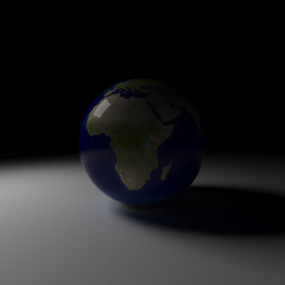
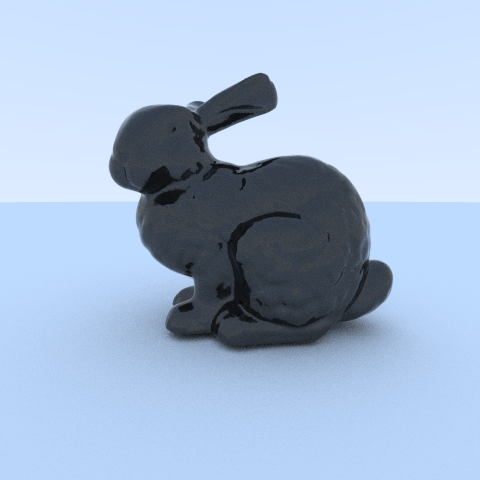
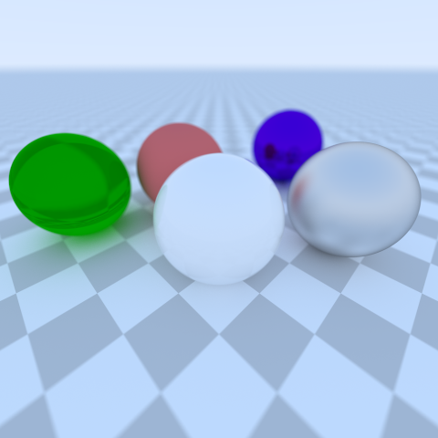
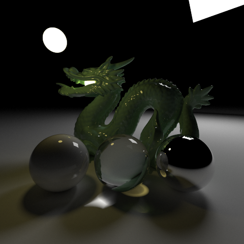
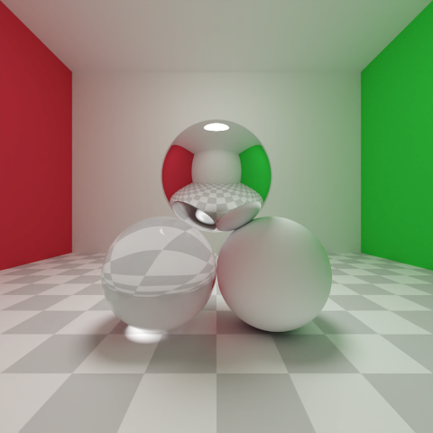

# go-pt

This project is a Monte Carlo path tracer written in Golang that runs on CPU only.

This scene consists of 871308 triangles and 6 spheres. It was rendered at 1500x1500 px at 8192 samples/pixel in 11 hours and 54 minutes on my Ryzen 7 2700X CPU.

## Features
### Implemented
- Parallel processing on multiple CPU cores
- BVH trees for optimized ray-triangle intersection tests
- Positionable camera with adjustable field of view and aperture
- 5 materials with adjustable properties (I will merge them into one BSDF):
    - Lambertian
        - color
    - Plastic
        - color
        - specularity
        - roughness
    - Metal
        - color
        - roughness
    - Dielectric
        - color
        - specularity
        - roughness
        - index of refraction
    - Emission
        - emission color
- Partial support for OBJ files (the program can parse triangles and their normals, but for now there's no support for textures or different materials for different parts of the model)
- Normal smoothing
- Textures
    - Generated textures
    - Image textures
    - For now they only work with spheres
### To-do
- Building scenes from files (probably JSON?)
- Transformations (translation, rotation, etc.)
- More primitives and BVH trees for them
    - Constructive solid geometry
- Full support for OBJ files
- Normal maps
- Volumetric rendering
- Importance sampling
- Spectral rendering

## Example renders

